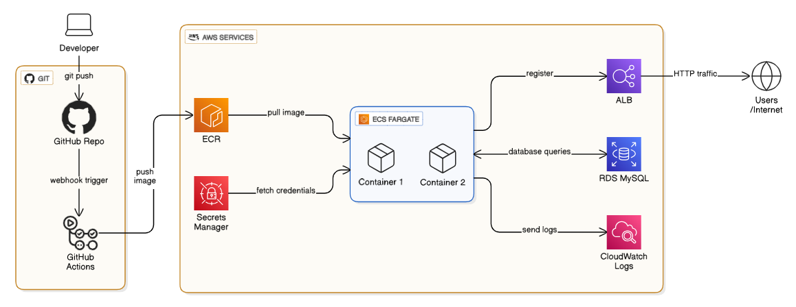

# Flask Message Board - AWS ECS Deployment

A simple Flask application deployed to AWS ECS Fargate with Docker containerization and load balancing.

## What This Is

A message board app where users can post messages. Built to learn AWS container deployment, Docker optimization, and DevOps practices.

**Stack**: Flask, MySQL, Docker, AWS ECS (Fargate), Application Load Balancer

## Features

- Flask app with MySQL database (RDS)
- Dockerized with multi-stage build (546 MB → 222 MB)
- Deployed on AWS ECS Fargate
- Load balanced with Application Load Balancer
- Secrets managed with AWS Secrets Manager
- Health check endpoints for monitoring

## Architecture



**Components:**
- **GitHub Actions**: CI/CD pipeline (build, test, deploy)
- **ECR**: Container registry for Docker images
- **ECS Fargate**: Serverless container orchestration
- **Application Load Balancer**: Traffic distribution and health checks
- **RDS MySQL**: Database (messages_db)
- **Secrets Manager**: Secure credential storage
- **CloudWatch**: Centralized logging

## Local Development

```bash
# Clone
git clone https://github.com/MokshangR/aws-devops-pipeline.git
cd aws-devops-pipeline/app

# Build and run with Docker
docker build -t flask-message-board .
docker run -d --env-file .env -p 5000:5000 flask-message-board

# Test
curl http://localhost:5000/health
```

## AWS Deployment

See [docs/CONSOLE-SETUP.md](docs/CONSOLE-SETUP.md) for complete setup guide.

Quick overview:

1. Create ECR repository, push image
2. Set up Secrets Manager for RDS credentials
3. Create ECS cluster and task definition
4. Configure ALB and target group
5. Deploy ECS service

## Project Structure

```
aws-devops-pipeline/
├── app/
│   ├── app.py              # Flask application
│   ├── config.py           # Configuration
│   ├── Dockerfile          # Multi-stage build
│   ├── gunicorn.conf.py    # Production server
│   └── requirements.txt
├── aws/
│   ├── ecs-task-definition.json    # ECS task config
│   └── service-config.json         # Service config
└── docs/
    └── CONSOLE-SETUP.md    # Setup guide
```

## Endpoints

| Endpoint  | Purpose                                |
| --------- | -------------------------------------- |
| `/`       | Message board interface                |
| `/health` | Liveness probe (container health)      |
| `/ready`  | Readiness probe (checks DB connection) |

## Docker Optimization

Used multi-stage build to reduce image size:

**Before**: 546 MB (includes build tools)
**After**: 222 MB (runtime only)

How:

- Stage 1: Install gcc and compile Python packages
- Stage 2: Copy compiled packages, discard build tools
- Bonus: Non-root user, health check instruction

## Environment Variables

```bash
FLASK_ENV=production
MYSQL_HOST=<from Secrets Manager>
MYSQL_USER=<from Secrets Manager>
MYSQL_PASSWORD=<from Secrets Manager>
MYSQL_PORT=3306
MYSQL_DB=messages_db
```

## What I Learned

1. **Docker multi-stage builds** - Separate build and runtime for smaller images
2. **ECS task vs service** - Task = container blueprint, Service = orchestration
3. **Health checks** - Liveness (restart if dead) vs Readiness (route traffic)
4. **AWS Secrets Manager** - Secure credential injection into containers
5. **Load balancing** - ALB distributes traffic between containers
6. **Blue-green deployments** - Circuit breaker for automatic rollback

## Roadmap

- [x] Flask app with MySQL
- [x] Docker containerization
- [x] Multi-stage build optimization
- [x] AWS ECS deployment
- [x] GitHub Actions CI/CD

## Monitoring

```bash
# View logs
aws logs tail /ecs/flask-message-board --follow --region ap-south-1

# Check service status
aws ecs describe-services \
  --cluster flask-cluster2 \
  --services flask-message-board-service \
  --region ap-south-1
```

## Security

- Container runs as non-root user (flaskapp:1000)
- Credentials stored in Secrets Manager (not hardcoded)
- Security headers (HSTS, CSP, X-Frame-Options)
- Minimal Docker image (smaller attack surface)

## License

MIT - See [LICENSE](LICENSE)

Built as a learning project to understand AWS container orchestration and DevOps workflows.
